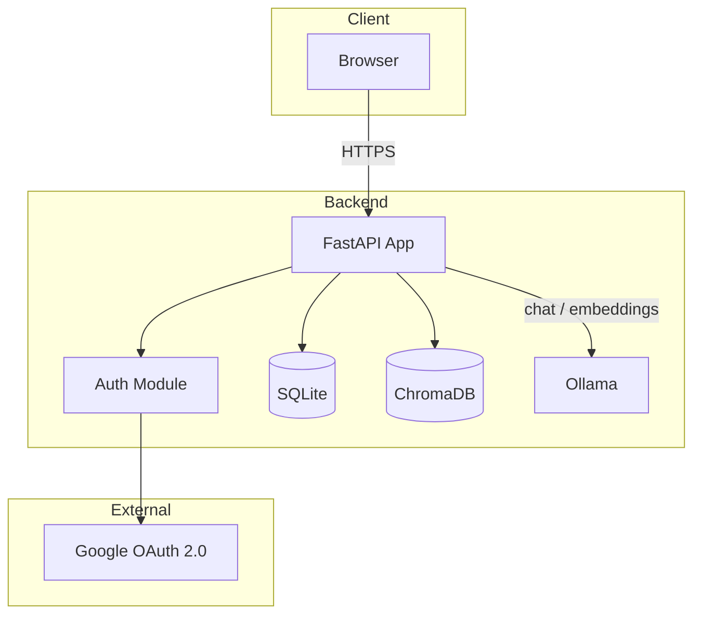
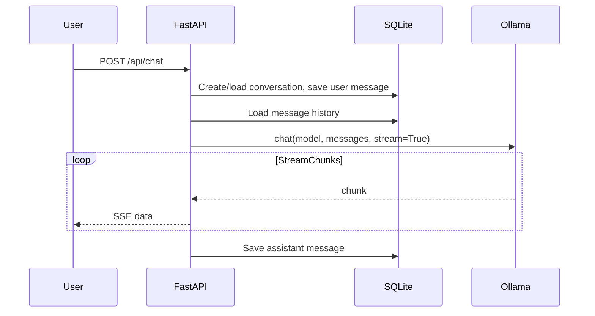
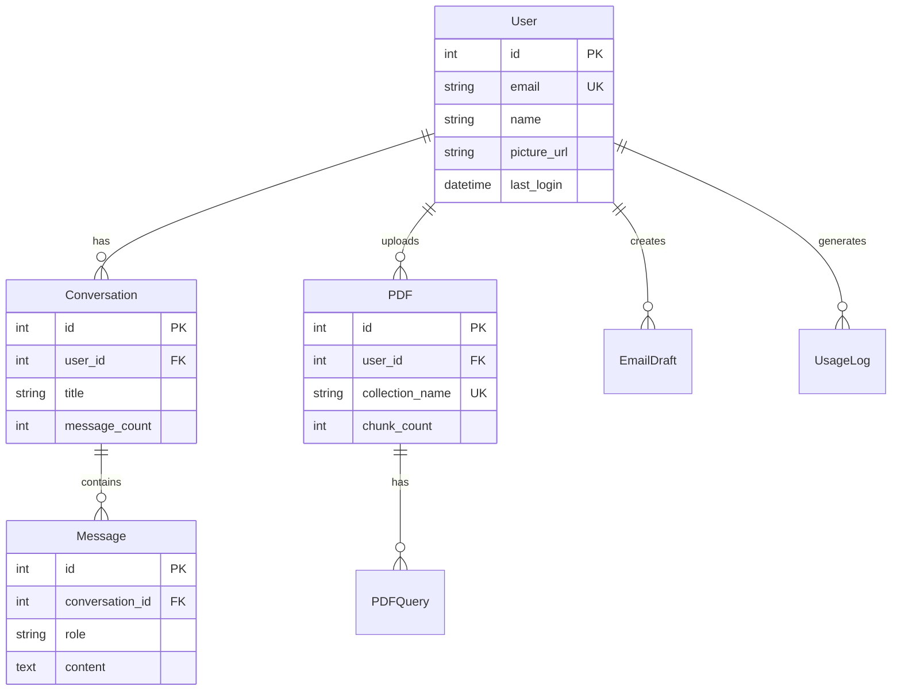

# Local AI Dashboard - Technical Specification

| Field | Value |
|-------|-------|
| **Status** | Draft |
| **Author** | — |
| **Last Updated** | 2026-02-15 |
| **Version** | 0.1 |
| **Summary** | Web app for chat, email generation, and PDF Q&A using local Ollama models. |

---

## 1. Overview

The Local AI Dashboard is a web application that provides AI-powered chat, email generation, and PDF question-answering using models running locally via Ollama. It uses Google OAuth for authentication, SQLite for persistence, and ChromaDB for vector search over PDF content. All inference runs on the user's machine with no recurring API costs.

---

## 2. Problem Statement

- Users need AI assistance (chat, email writing, document Q&A) without sending sensitive data to cloud APIs.
- There is a need for a self-hosted, privacy-preserving solution that runs on consumer hardware and incurs no per-request fees.

---

## 3. Goals and Non-Goals

### Goals

- Run AI inference locally via Ollama (zero recurring API cost).
- Support multi-turn chat, email drafting, and PDF RAG.
- Persist conversations, drafts, and PDF metadata per user.
- Single-user or small-team deployment with Google sign-in.

### Non-Goals

- Production-scale multi-tenant SaaS.
- Support for cloud-hosted LLM APIs (OpenAI, etc.).
- Real-time collaborative editing.
- Offline-first or PWA capabilities.

---

## 4. Architecture

### System Diagram



### Component Responsibilities

| Component | Location | Responsibility |
|-----------|----------|-----------------|
| FastAPI app | [app.py](../app.py) | HTTP routes, orchestration, SSE streaming |
| Auth | [auth.py](../auth.py) | Google OAuth, session validation |
| DB layer | [database/](../database/) | SQLAlchemy models, CRUD |
| ChromaDB | In-memory | PDF chunk embeddings, vector search |
| Ollama | Local process | Chat completion, embeddings |
| Templates | [templates/](../templates/) | Jinja2 HTML, vanilla JS |

### Data Flow (Chat Example)



---

## 5. API Specification

| Method | Endpoint | Auth | Description |
|--------|----------|------|-------------|
| GET | `/` | Session | Dashboard (HTML) |
| GET | `/login` | — | Initiate Google OAuth |
| GET | `/auth/callback` | — | OAuth callback |
| GET | `/logout` | — | Clear session |
| GET | `/login-page` | — | Login page (HTML) |
| GET | `/api/models` | — | List Ollama models |
| POST | `/api/chat` | Required | Chat (SSE stream) |
| GET | `/api/conversations` | Required | List user conversations |
| GET | `/api/conversations/{id}` | Required | Get conversation + messages |
| DELETE | `/api/conversations/{id}` | Required | Delete conversation |
| GET | `/api/conversations/search?q=` | Required | Search conversations |
| POST | `/api/email` | Required | Generate email (SSE stream) |
| GET | `/api/email/drafts` | Required | List email drafts |
| GET | `/api/email/drafts/{id}` | Required | Get draft detail |
| POST | `/api/pdf/upload` | Required | Upload and index PDF |
| GET | `/api/pdfs` | Required | List user PDFs |
| POST | `/api/pdf/ask` | Required | Query PDF (SSE stream) |
| GET | `/api/pdf/{id}/history` | Required | PDF query history |
| DELETE | `/api/pdf/{id}` | Required | Delete PDF |
| GET | `/api/stats` | Required | User usage stats |

### Key Request/Response Schemas

- **Chat:** `POST /api/chat` — form: `message`, `conversation_id?`, `model?`
- **Email:** `POST /api/email` — form: `description`, `tone`, `save_draft`, `model?`
- **PDF ask:** `POST /api/pdf/ask` — form: `question`, `pdf_id`, `model?`

---

## 6. Data Model

### Entity Relationship



**Tables (7):** users, conversations, messages, pdfs, pdf_queries, email_drafts, usage_logs. Full schema defined in [database/models.py](../database/models.py).

---

## 7. Security and Privacy

- **Auth:** Google OAuth 2.0 (openid, email, profile); session cookie (SessionMiddleware).
- **Data locality:** AI runs locally (Ollama); no user content sent to third parties except Google for auth.
- **Secrets:** `SECRET_KEY`, `GOOGLE_CLIENT_ID`, `GOOGLE_CLIENT_SECRET` via `.env`; `.env` must be gitignored.
- **Authorization:** All `/api/*` (except `/api/models`) require valid session; ownership enforced in CRUD (user_id checks).
- **File storage:** Uploads in `uploads/`; filenames sanitized with user_id + timestamp prefix.
- **Vector DB:** ChromaDB in-memory; collections named per-user per-upload; no cross-user access.

---

## 8. Configuration and Deployment

### Environment Variables

| Variable | Required | Default | Description |
|----------|----------|---------|-------------|
| SECRET_KEY | Yes | — | Session signing key |
| GOOGLE_CLIENT_ID | Yes | — | OAuth client ID |
| GOOGLE_CLIENT_SECRET | Yes | — | OAuth client secret |
| OLLAMA_MODEL | No | llama3.2:latest | Default chat/completion model |
| OLLAMA_EMBEDDING_MODEL | No | nomic-embed-text | PDF embedding model |

### Prerequisites

- Python 3.10+
- Ollama running locally (`ollama serve`)
- Models: `ollama pull llama3.2`, `ollama pull nomic-embed-text`

### Run

```bash
cd web-ui && pip install -r requirements.txt && python init_db.py && uvicorn app:app --reload
```

---

## 9. Limitations and Future Work

- **ChromaDB:** In-memory only; restarts lose embeddings; PDFs must be re-uploaded.
- **SQLite:** Single-writer; not suitable for high concurrency.
- **Synchronous PDF processing:** Upload blocks until embedding completes.
- **No rate limiting:** Single-user/small-team assumed.

### Future Considerations

- Persist ChromaDB to disk.
- Optional PostgreSQL for multi-user scale.
- Async job queue for PDF indexing.
- Rate limiting and request quotas.

---

## 10. Appendix

### File Layout

```
web-ui/
├── app.py              # FastAPI app, routes
├── auth.py             # Google OAuth
├── init_db.py          # DB initialization
├── requirements.txt
├── database/
│   ├── __init__.py
│   ├── models.py       # SQLAlchemy models
│   ├── db.py           # Engine, session
│   ├── crud.py         # CRUD operations
│   └── DATABASE_README.md
├── templates/
│   ├── index.html
│   └── login.html
├── docs/
│   └── TECH_SPEC.md
└── uploads/            # PDF uploads (created at runtime)
```

### References

- [Ollama API](https://github.com/ollama/ollama/blob/main/docs/api.md)
- [FastAPI](https://fastapi.tiangolo.com/)
- [Authlib](https://docs.authlib.org/)
- [ChromaDB](https://docs.trychroma.com/)
- [SQLAlchemy](https://docs.sqlalchemy.org/)

### Glossary

| Term | Definition |
|------|------------|
| RAG | Retrieval-Augmented Generation: using vector search to fetch relevant document chunks before generating an LLM response. |
| SSE | Server-Sent Events: HTTP streaming protocol for pushing updates from server to client. |
| OAuth 2.0 | Authorization framework for delegating access without sharing credentials. |
| Embedding | Dense vector representation of text used for semantic similarity search. |
