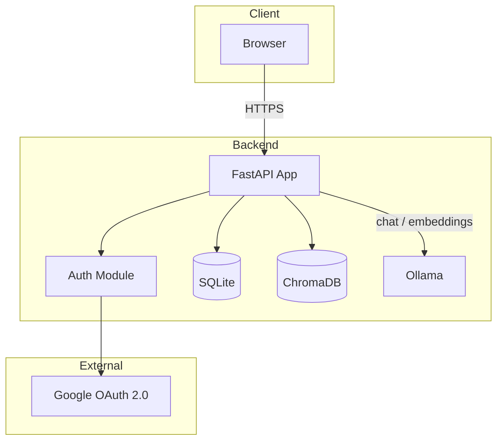
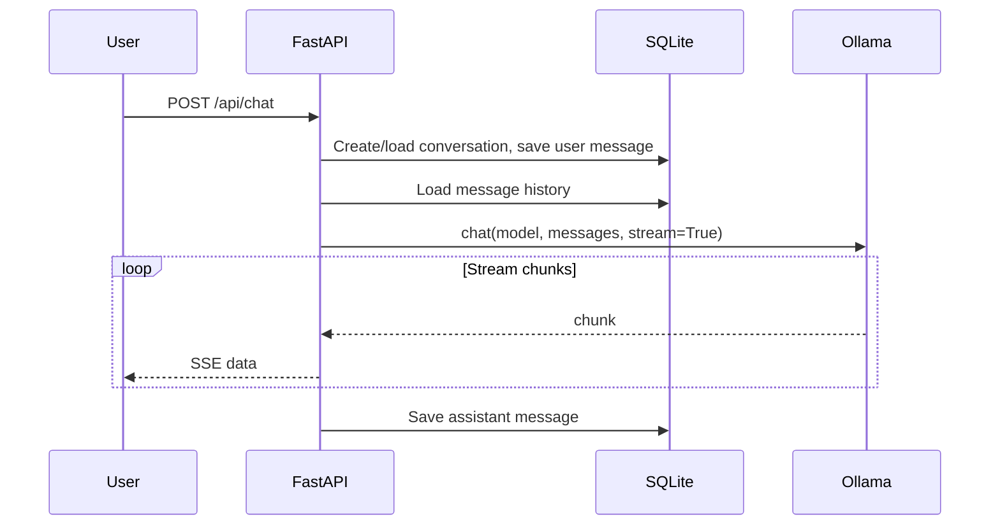
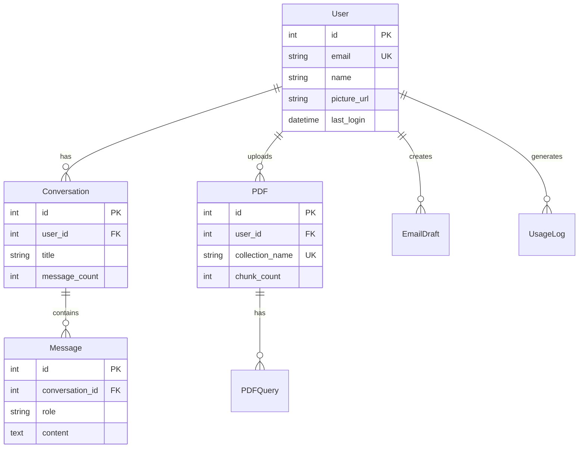

# Local AI Dashboard - Technical Specification

## Document structure

Create [ollama-python/web-ui/docs/TECH_SPEC.md](ollama-python/web-ui/docs/TECH_SPEC.md) with the following sections, following design-doc conventions used at Google and similar companies.

---

### 1. Header and metadata

- Title: "Local AI Dashboard - Technical Specification"
- Status (Draft | Approved)
- Author, Last Updated, Version
- One-line summary

---

### 2. Overview

Concise 2-3 sentence description: a web application that provides chat, email generation, and PDF Q&A using local Ollama models, with Google OAuth, SQLite persistence, and ChromaDB for vector search.

---

### 3. Problem statement

- Users need AI assistance (chat, email writing, document Q&A) without sending data to cloud APIs
- Call for a self-hosted, privacy-preserving solution that runs on consumer hardware

---

### 4. Goals and non-goals

**Goals**

- Run AI inference locally via Ollama (zero recurring API cost)
- Support multi-turn chat, email drafting, and PDF RAG
- Persist conversations, drafts, and PDF metadata per user
- Single-user or small-team deployment with Google sign-in

**Non-goals**

- Production-scale multi-tenant SaaS
- Support for cloud-hosted LLM APIs (OpenAI, etc.)
- Real-time collaborative editing
- Offline-first or PWA capabilities

---

### 5. Architecture

**System diagram (mermaid)**




**Component responsibilities**


| Component   | Location                                      | Responsibility                            |
| ----------- | --------------------------------------------- | ----------------------------------------- |
| FastAPI app | [app.py](ollama-python/web-ui/app.py)         | HTTP routes, orchestration, SSE streaming |
| Auth        | [auth.py](ollama-python/web-ui/auth.py)       | Google OAuth, session validation          |
| DB layer    | [database/](ollama-python/web-ui/database/)   | SQLAlchemy models, CRUD                   |
| ChromaDB    | In-memory                                     | PDF chunk embeddings, vector search       |
| Ollama      | Local process                                 | Chat completion, embeddings               |
| Templates   | [templates/](ollama-python/web-ui/templates/) | Jinja2 HTML, vanilla JS                   |


**Data flow (chat example)**




---

### 6. API specification


| Method | Endpoint                       | Auth     | Description                 |
| ------ | ------------------------------ | -------- | --------------------------- |
| GET    | `/`                            | Session  | Dashboard (HTML)            |
| GET    | `/login`                       | -        | Initiate Google OAuth       |
| GET    | `/auth/callback`               | -        | OAuth callback              |
| GET    | `/logout`                      | -        | Clear session               |
| GET    | `/login-page`                  | -        | Login page (HTML)           |
| GET    | `/api/models`                  | -        | List Ollama models          |
| POST   | `/api/chat`                    | Required | Chat (SSE stream)           |
| GET    | `/api/conversations`           | Required | List user conversations     |
| GET    | `/api/conversations/{id}`      | Required | Get conversation + messages |
| DELETE | `/api/conversations/{id}`      | Required | Delete conversation         |
| GET    | `/api/conversations/search?q=` | Required | Search conversations        |
| POST   | `/api/email`                   | Required | Generate email (SSE stream) |
| GET    | `/api/email/drafts`            | Required | List email drafts           |
| GET    | `/api/email/drafts/{id}`       | Required | Get draft detail            |
| POST   | `/api/pdf/upload`              | Required | Upload and index PDF        |
| GET    | `/api/pdfs`                    | Required | List user PDFs              |
| POST   | `/api/pdf/ask`                 | Required | Query PDF (SSE stream)      |
| GET    | `/api/pdf/{id}/history`        | Required | PDF query history           |
| DELETE | `/api/pdf/{id}`                | Required | Delete PDF                  |
| GET    | `/api/stats`                   | Required | User usage stats            |


**Key request/response schemas**

- Chat: `POST /api/chat` — form: `message`, `conversation_id?`, `model?`
- Email: `POST /api/email` — form: `description`, `tone`, `save_draft`, `model?`
- PDF ask: `POST /api/pdf/ask` — form: `question`, `pdf_id`, `model?`

---

### 7. Data model

**Entity relationship (mermaid)**




**Tables (7):** users, conversations, messages, pdfs, pdf_queries, email_drafts, usage_logs. Full schema defined in [database/models.py](ollama-python/web-ui/database/models.py).

---

### 8. Security and privacy

- **Auth:** Google OAuth 2.0 (openid, email, profile); session cookie (SessionMiddleware)
- **Data locality:** AI runs locally (Ollama); no user content sent to third parties except Google for auth
- **Secrets:** `SECRET_KEY`, `GOOGLE_CLIENT_ID`, `GOOGLE_CLIENT_SECRET` via `.env`; `.env` must be gitignored
- **Authorization:** All `/api/`* (except `/api/models`) require valid session; ownership enforced in CRUD (user_id checks)
- **File storage:** Uploads in `uploads/`; filenames sanitized with user_id + timestamp prefix
- **Vector DB:** ChromaDB in-memory; collections named per-user per-upload; no cross-user access

---

### 9. Configuration and deployment

**Environment variables**


| Variable               | Required | Default          | Description                   |
| ---------------------- | -------- | ---------------- | ----------------------------- |
| SECRET_KEY             | Yes      | -                | Session signing key           |
| GOOGLE_CLIENT_ID       | Yes      | -                | OAuth client ID               |
| GOOGLE_CLIENT_SECRET   | Yes      | -                | OAuth client secret           |
| OLLAMA_MODEL           | No       | llama3.2:latest  | Default chat/completion model |
| OLLAMA_EMBEDDING_MODEL | No       | nomic-embed-text | PDF embedding model           |


**Prerequisites**

- Python 3.10+
- Ollama running locally (`ollama serve`)
- Models: `ollama pull llama3.2`, `ollama pull nomic-embed-text`

**Run**

```bash
cd web-ui && pip install -r requirements.txt && python init_db.py && uvicorn app:app --reload
```

---

### 10. Limitations and future work

- **ChromaDB:** In-memory only; restarts lose embeddings; PDFs must be re-uploaded
- **SQLite:** Single-writer; not suitable for high concurrency
- **Synchronous PDF processing:** Upload blocks until embedding completes
- **No rate limiting:** Single-user/small-team assumed

**Future considerations**

- Persist ChromaDB to disk
- Optional PostgreSQL for multi-user scale
- Async job queue for PDF indexing
- Rate limiting and request quotas

---

### 11. Appendix

- **File layout:** Reference to web-ui directory structure
- **References:** Ollama API docs, FastAPI docs, Authlib
- **Glossary:** RAG, SSE, OAuth 2.0, embedding

---

## Implementation

1. Create `ollama-python/web-ui/docs/` directory.
2. Create `ollama-python/web-ui/docs/TECH_SPEC.md` with the full content above, including all mermaid diagrams and tables.
3. Ensure mermaid node IDs follow conventions (no spaces, no reserved words like `end`).

